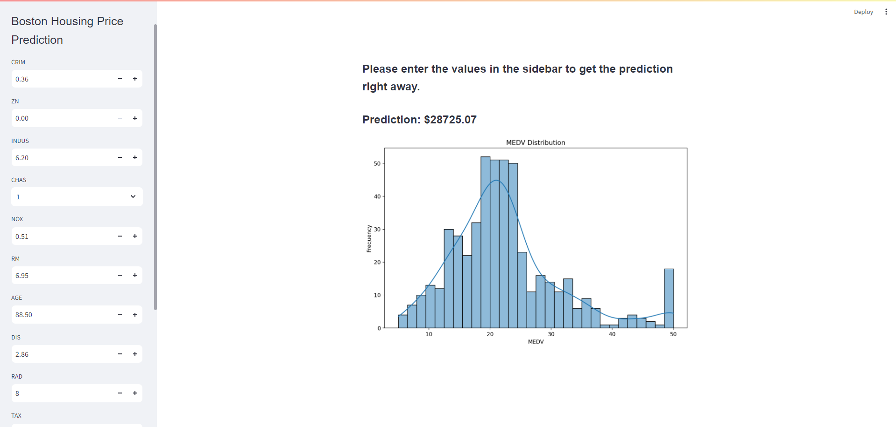

# Boston Housing 

## Introduction 
Build a model for predict the house price in Boston and construct a basic web application to run the ML model.

"

**How to run?** In the terminal, run these codes: 
```shell
git clone https://github.com/sinhvienfpt/udacity-disaster-response-pipeline.git
cd app 
python run.py
```
Then go to http://localhost:8501/ to try it.

## Installation
Using ```pip install -r requirements.txt``` 

The following is the libraries versions and supported Python versions.
```# Python version
python~=3.11.7

scikit-learn~=0.18 
pandas~=1.5.3
streamlit~=1.32.0
numpy~=1.24.4
matplotlib~=3.9.0
scipy==1.14.0
seaborn==0.13.2
```

## About the problem
You are a Data Scientist with a housing agency in Boston MA, you have been given access to a previous dataset on housing prices derived from the U.S. Census Service to present insights to higher management. Based on your experience in Statistics, what information can you provide them to help with making an informed decision? Upper management will like to get some insight into the following.
+ Is there a significant difference in the median value of houses bounded by the Charles river or not?
+ Is there a difference in median values of houses of each proportion of owner-occupied units built before 1940?
+ Can we conclude that there is no relationship between Nitric oxide concentrations and the proportion of non-retail business acres per town?
+ What is the impact of an additional weighted distance to the five Boston employment centres on the median value of owner-occupied homes?

Using the appropriate graphs and charts, generate basic statistics and visualizations that you think will be useful for the upper management to give them important insight given the question they are asking, in your graphs, include an explanation of each statistic. 

**Task 1**: Familiarize yourself with the dataset 

**Task 2**: (Optional) If you do not already have an instance of Watson Studio, create an IBM Cloud Lite account and provision an instance of Waston Studio.

**Task 3**: Load the dataset in a Jupyter Notebook using Watson Studio.

**Task 4**: Generate basic statistics and visualizations for upper management. 

**Task 5**: Use the appropriate tests to answer the questions provided.

## Data Description
|COLUMN NAME|DATA TYPE|DESCRIPTION| Ý nghĩa|
|----|----|---|---|
|CRIM|FLOAT|per capita crime rate by town| tỷ lệ tội phạm bình quân đầu người theo thị trấn|
|ZN|FLOAT|proportion of residential land zoned for lots over 25,000 sq.ft.| tỷ lệ đất ở được quy hoạch cho các lô có diện tích trên 25.000 sq.ft.|
|INDUS|FLOAT|proportion of non-retail business acres per town| tỷ lệ diện tích đất dành cho hoạt động kinh doanh phi bán lẻ trong mỗi thị trấn|
|CHAS|BIT|Charles River dummy variable (1 if tract bounds river; 0 otherwise)| biến giả cho sông Charles (1 nếu khu vực giáp sông; 0 nếu không)|
|NOX|FLOAT|nitric oxides concentration (parts per 10 million)| nồng độ oxit nitric NO (phần trên 10 triệu)|
|RM|FLOAT|average number of rooms per dwelling| số phòng trung bình trên mỗi nhà ở|
|AGE|FLOAT|proportion of owner-occupied units built prior to 1940| tỷ lệ các căn nhà do chủ sở hữu ở được xây dựng trước năm 1940|
|DIS|FLOAT|weighted distances to five Boston employment centres| khoảng cách có trọng số đến năm trung tâm việc làm ở Boston|
|RAD|INT|index of accessibility to radial highways| chỉ số khả năng tiếp cận các đường cao tốc hướng tâm|
|TAX|FLOAT|full-value property-tax rate per $10,000| tỷ lệ thuế bất động sản đầy đủ trên mỗi $10,000|
|PTRATIO|FLOAT|pupil-teacher ratio by town| tỷ lệ học sinh trên giáo viên theo thị trấn|
|B|FLOAT|1000(Bk - 0.63)^2 where Bk is the proportion of blacks by town| 1000(Bk - 0.63)^2 trong đó Bk là tỷ lệ người da đen theo thị trấn|
|LSTAT|FLOAT|% lower status of the population| tỷ lệ phần trăm dân số có địa vị thấp hơn|
|MEDV|FLOAT|Median value of owner-occupied homes in $1000's| Giá trị trung vị của nhà ở do chủ sở hữu ở tính bằng $1000|